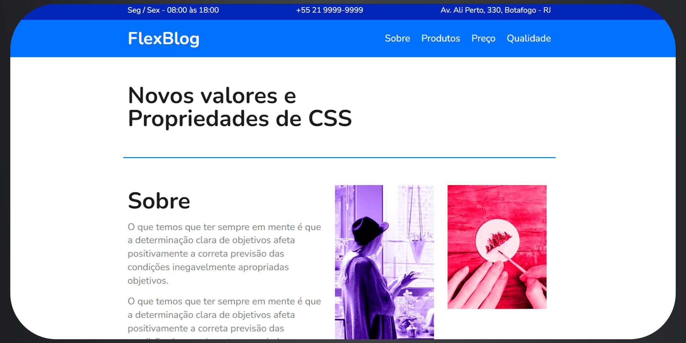
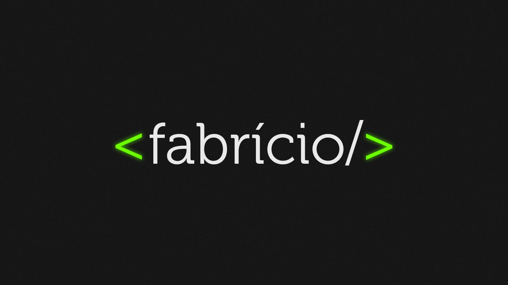

<h1 align= "center">
            FlexBlog
</h1>
<h1 align= "center">
            
</h1>
 

<h3 align="center">You can access the project <a href="https://flexblog-dev.vercel.app/" target="_blank">Clicking here</a></h3>
 

---

 

# 📌 About
 

<h3>FlexBlog is a simple News Blog made for test my skills.</h3>

 

# ⚙ Technologies

- [HTML](https://www.w3schools.com/html/)
- [CSS](https://www.w3schools.com/css/)

---

 

<h1 align= "center">
            
</h1>

 Developed by <a href="https://github.com/Fabricio-souza-miranda">Fabrício Souza Miranda</a> 🪐
